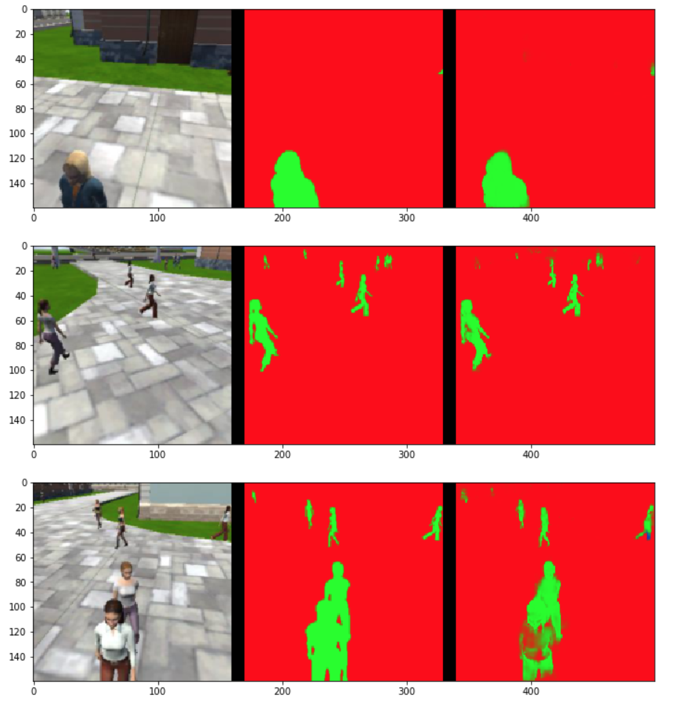

# Project 4: Follow Me
### Saminda Abeyruwan

In this project, we have developed an encoder-decoder deep segmentation network from images streamed from a simulated drone. 

## Train-Validate-Evaluate

As a starting point, we have used the training, validating, and evaluating datasets provided by Udacity. It turns out to be that we are able to to obtain the passing grade with the datasets. Therefore, we have not collected additional datasets from the simulator. A summary of Udacity datasets is given below.

| Path | Images and Masks|
| :-- | :---------------:|
| /data/train | 4131|
| /data/validation| 1184|
| /data/sample\_evaluation\_data/following\_images | 542 | 
| /data/sample\_evaluation\_data/patrol\_non\_targ | 270|
| /data/sample\_evaluation\_data/patrol\_with\_targ | 322|

## Encoder-Decoder Segmentation Network

Image segmentation is the process of partitioning a digital image into multiple segments. In this process, each pixel is assigned with labels that share common characteristics. In this discussion, we are focusing on segmentation via _fully convolution networks_.

A convolutional neural network (CNN) is a category of neural networks that provides constructs to capture spacial information of inputs, e.g., images, for classification and other tasks. It consists of convolution, pooling, and normalizing layers, which captures lines, shapes, and regions of interest for the task at hand. 

A fully convolution neural network (FCN) is a CNN, where the last fully connected layers are substituted by another CNN using 1x1 convolution. A _1x1 convolution_ simply maps an input pixel with all its channels to an output pixel. It is also an efficient way to increase or decrease depth of a volume. 

After 1x1 convolution, an upsampling is performed to match the input and output shapes. A FCN captures the global context of the scene and enables to label objects and their approximate locations in the images. One downside is though, due to downsampling in the CNN part, this approach loses _some_ resolution. To solve this problem, a method, _skiping_, has been proposed to get activations from previous layers, and then sum or concatenate or interpolate.

In order to obtain better segmentation, an encoder-decoder network has been proposed. 

The _convolution network_ or encoder, extract features of an image, while _deconvolution network_ or decoder, reverses the convolution network until the output has the same shape as the input. The 1x1 convolution preserves the localization information and scaling up to original image size in the output activates pixels to indicate objects and their approximate locations in the image. Similar to FCN, this architecture also loses some information, where skipping connections are used to solve this problem.  

When we have designed the convolutional blocks (as shown in the figure), we have used _depthwise separable convolutions_ technique, which, comprise of a convolution performed over each channel of an input layer and followed by a 1x1 convolution that takes the output channels from the previous step and then combines them into an output layer. This method reduces the number of parameters needed to represent spacial information, while improving runtime performance, and added benefit of reducing overfitting to an extent. We have developed the encoder block using _SeparableConv2DKeras_ and the instructions available in the notebook. 

Our decoder has used _bilinear upsampling_, which utilizes the weighted average of four nearest known pixels, located diagonally to a given pixel, to estimate a new pixel intensity value. We have developed the blocks using _BilinearUpSampling2D_. 

We have also used _batch normalization_ in between layers. During the training phase, this method, normalizes inputs to each layer using  mean and variance of the values in the current mini-batch. It has been shown that with batch normalization: the networks train faster, we can use higher learning rates, and to some extent provides some regularization.

The complete details of the deep network is as follows:

	Layer (type)                 Output Shape              Param #   
	=================================================================
	input_1 (InputLayer)         (None, 160, 160, 3)       0         
	_________________________________________________________________
	separable_conv2d_keras_1 (Se (None, 80, 80, 32)        155       
	_________________________________________________________________
	batch_normalization_1 (Batch (None, 80, 80, 32)        128       
	_________________________________________________________________
	separable_conv2d_keras_2 (Se (None, 40, 40, 64)        2400      
	_________________________________________________________________
	batch_normalization_2 (Batch (None, 40, 40, 64)        256       
	_________________________________________________________________
	separable_conv2d_keras_3 (Se (None, 20, 20, 128)       8896      
	_________________________________________________________________
	batch_normalization_3 (Batch (None, 20, 20, 128)       512       
	_________________________________________________________________
	separable_conv2d_keras_4 (Se (None, 10, 10, 256)       34176     
	_________________________________________________________________
	batch_normalization_4 (Batch (None, 10, 10, 256)       1024      
	_________________________________________________________________
	separable_conv2d_keras_5 (Se (None, 5, 5, 512)         133888    
	_________________________________________________________________
	batch_normalization_5 (Batch (None, 5, 5, 512)         2048      
	_________________________________________________________________
	conv2d_1 (Conv2D)            (None, 5, 5, 512)         262656    
	_________________________________________________________________
	batch_normalization_6 (Batch (None, 5, 5, 512)         2048      
	_________________________________________________________________
	bilinear_up_sampling2d_1 (Bi (None, 10, 10, 512)       0         
	_________________________________________________________________
	concatenate_1 (Concatenate)  (None, 10, 10, 768)       0         
	_________________________________________________________________
	separable_conv2d_keras_6 (Se (None, 10, 10, 512)       400640    
	_________________________________________________________________
	batch_normalization_7 (Batch (None, 10, 10, 512)       2048      
	_________________________________________________________________
	separable_conv2d_keras_7 (Se (None, 10, 10, 512)       267264    
	_________________________________________________________________
	batch_normalization_8 (Batch (None, 10, 10, 512)       2048      
	_________________________________________________________________
	separable_conv2d_keras_8 (Se (None, 10, 10, 512)       267264    
	_________________________________________________________________
	batch_normalization_9 (Batch (None, 10, 10, 512)       2048      
	_________________________________________________________________
	bilinear_up_sampling2d_2 (Bi (None, 20, 20, 512)       0         
	_________________________________________________________________
	concatenate_2 (Concatenate)  (None, 20, 20, 640)       0         
	_________________________________________________________________
	separable_conv2d_keras_9 (Se (None, 20, 20, 256)       169856    
	_________________________________________________________________
	batch_normalization_10 (Batc (None, 20, 20, 256)       1024      
	_________________________________________________________________
	separable_conv2d_keras_10 (S (None, 20, 20, 256)       68096     
	_________________________________________________________________
	batch_normalization_11 (Batc (None, 20, 20, 256)       1024      
	_________________________________________________________________
	separable_conv2d_keras_11 (S (None, 20, 20, 256)       68096     
	_________________________________________________________________
	batch_normalization_12 (Batc (None, 20, 20, 256)       1024      
	_________________________________________________________________
	bilinear_up_sampling2d_3 (Bi (None, 40, 40, 256)       0         
	_________________________________________________________________
	concatenate_3 (Concatenate)  (None, 40, 40, 320)       0         
	_________________________________________________________________
	separable_conv2d_keras_12 (S (None, 40, 40, 128)       43968     
	_________________________________________________________________
	batch_normalization_13 (Batc (None, 40, 40, 128)       512       
	_________________________________________________________________
	separable_conv2d_keras_13 (S (None, 40, 40, 128)       17664     
	_________________________________________________________________
	batch_normalization_14 (Batc (None, 40, 40, 128)       512       
	_________________________________________________________________
	separable_conv2d_keras_14 (S (None, 40, 40, 128)       17664     
	_________________________________________________________________
	batch_normalization_15 (Batc (None, 40, 40, 128)       512       
	_________________________________________________________________
	bilinear_up_sampling2d_4 (Bi (None, 80, 80, 128)       0         
	_________________________________________________________________
	concatenate_4 (Concatenate)  (None, 80, 80, 160)       0         
	_________________________________________________________________
	separable_conv2d_keras_15 (S (None, 80, 80, 64)        11744     
	_________________________________________________________________
	batch_normalization_16 (Batc (None, 80, 80, 64)        256       
	_________________________________________________________________
	separable_conv2d_keras_16 (S (None, 80, 80, 64)        4736      
	_________________________________________________________________
	batch_normalization_17 (Batc (None, 80, 80, 64)        256       
	_________________________________________________________________
	separable_conv2d_keras_17 (S (None, 80, 80, 64)        4736      
	_________________________________________________________________
	batch_normalization_18 (Batc (None, 80, 80, 64)        256       
	_________________________________________________________________
	bilinear_up_sampling2d_5 (Bi (None, 160, 160, 64)      0         
	_________________________________________________________________
	concatenate_5 (Concatenate)  (None, 160, 160, 67)      0         
	_________________________________________________________________
	separable_conv2d_keras_18 (S (None, 160, 160, 32)      2779      
	_________________________________________________________________
	batch_normalization_19 (Batc (None, 160, 160, 32)      128       
	_________________________________________________________________
	separable_conv2d_keras_19 (S (None, 160, 160, 32)      1344      
	_________________________________________________________________
	batch_normalization_20 (Batc (None, 160, 160, 32)      128       
	_________________________________________________________________
	separable_conv2d_keras_20 (S (None, 160, 160, 32)      1344      
	_________________________________________________________________
	batch_normalization_21 (Batc (None, 160, 160, 32)      128       
	_________________________________________________________________
	conv2d_2 (Conv2D)            (None, 160, 160, 3)       99        
	=================================================================
	Total params: 1,807,385
	Trainable params: 1,798,425
	Non-trainable params: 8,960
	_________________________________________________________________
	
Summary (as blocks):
	
	inputs  : (?, 160, 160, 3)
	encoder1: (?, 80, 80, 32)
	encoder2: (?, 40, 40, 64)
	encoder3: (?, 20, 20, 128)
	encoder4: (?, 10, 10, 256)
	encoder5: (?, 5, 5, 512)
	1x1     : (?, 5, 5, 512)
	decoder1: (?, 10, 10, 512)
	decoder2: (?, 20, 20, 256)
	decoder3: (?, 40, 40, 128)
	decoder4: (?, 80, 80, 64)
	x:        (?, 160, 160, 32)

We have used the following hyper-parameters:

	learning_rate    = 0.001
	batch_size       = 32
	num_epochs       = 100
	steps_per_epoch  = 130
	validation_steps = 37
	workers          = 4
	
The training-validation graphs:

	
	
We have trained the model on a AWS instance following the project instructions. 

## Prediction

The following sample predictions are obtained from the notebook.

- __following\_images__: tests how well the network can identify the target while following them.

- __patrol\_non\_targ__: tests how often the network makes a mistake and identifies the wrong person as the target.

- __patrol\_with\_targ__: test how well the network can detect the hero from a distance.

We have used IoU to calculate the final score. The IoU is the _intersection_ over _union_. Our model has achieved a final score: __0.449953032283__.

HTML version is available from: [link](./code/model_training.html)

### Network Limitations

We have trained the network using the images and mask related to _Hero_ and other people. Therefore, our network can not identifying other objects of interest. The network can be used to detect and localize other objects, e.g.,  dogs, signs or cars, so on, if we collect training and validation sets and the corresponding masks.

### Future Work

- Recoding an enhanced dataset from the simulator to capture the scenarios where the model needs more data. 
- Experiment with layers to obtain better performance.
- Experiment with other segmentation architectures. 

### References

- [Image Semantic Segmentation](https://wiki.tum.de/display/lfdv/Image+Semantic+Segmentation)
- [Image Segmentation](https://leonardoaraujosantos.gitbooks.io/artificial-inteligence/content/image_segmentation.html)
- [Fully Convolution Networks](http://tutorial.caffe.berkeleyvision.org/caffe-cvpr15-pixels.pdf)

 
